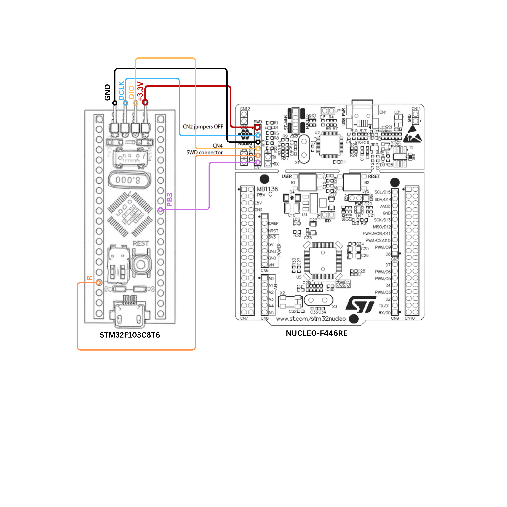

# STM32F103C8T6 Blue Pill to NUCLEO-F446RE ST-LINK Connection

A simple SWD connection diagram showing how to connect an **STM32F103C8T6 Blue Pill** to the **NUCLEO-F446RE** and use its onboard **ST-LINK/V2-1** for programming and debugging.

## Why I Created This

While working with the STM32F103C8T6 Blue Pill, I wanted to use the onboard ST-LINK of my NUCLEO-F446RE to program and debug the Blue Pill.

Although ST documents that the ST-LINK on NUCLEO boards can be used to program and debug external STM32 targets, I could not find a simple wiring diagram specifically showing the connection between the **NUCLEO-F446RE** and **STM32F103C8T6 Blue Pill**.

Since the NUCLEO-F446RE is an expensive development board, I wanted to verify the connections carefully before connecting the boards.

After verifying the required connections, I created this diagram as a quick reference for anyone facing the same problem.

## Connection Diagram

## Connection

The connection uses the **SWD (Serial Wire Debug)** interface.

| STM32F103C8T6 Blue Pill | NUCLEO-F446RE |
|---|---|
| SWDIO | ST-LINK SWDIO |
| SWCLK | ST-LINK SWCLK |
| GND | GND |
| 3.3V | 3.3V |
| NRST | NRST |

## What Can This Connection Be Used For?

The NUCLEO-F446RE's onboard ST-LINK can be used to program and debug the external STM32F103C8T6 target.

This allows you to:

- Flash firmware to the STM32F103C8T6
- Debug firmware using SWD
- Use breakpoints and step debugging
- Program the Blue Pill from STM32CubeIDE
- Debug an external STM32 target without a separate ST-LINK programmer

## Hardware Used

- **STM32F103C8T6 Blue Pill**
- **NUCLEO-F446RE**
- Jumper wires

## Important

Before making the connection:

1. Verify the pinout of your specific STM32F103C8T6 board.
2. Verify the SWDIO and SWCLK connections.
3. Make sure the boards share a common ground.
4. Verify the target voltage before powering the board.
5. Avoid connecting multiple power sources incorrectly.
6. Check the ST-LINK configuration of the NUCLEO board before programming the external target.

## Keywords

STM32F103C8T6, STM32 Blue Pill, Blue Pill, NUCLEO-F446RE, NUCLEO F446RE, ST-LINK, ST-LINK/V2-1, SWD, SWDIO, SWCLK, STM32 programmer, STM32 debugger, STM32CubeIDE, external STM32 target, STM32 programming, STM32 debugging, embedded systems.

## License

This documentation is provided for educational and reference purposes.
